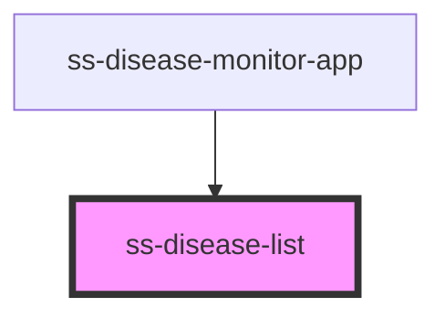

# ss-disease-list

<!-- Auto Generated Below -->

## Events

| Event           | Description | Type                  |
| --------------- | ----------- | --------------------- |
| `entry-clicked` |             | `CustomEvent<string>` |

## Dependencies

### Used by

 - [ss-disease-monitor-app](../ss-disease-monitor-app)

### Graph

----------------------------------------------

*Built with [StencilJS](https://stenciljs.com/)*
