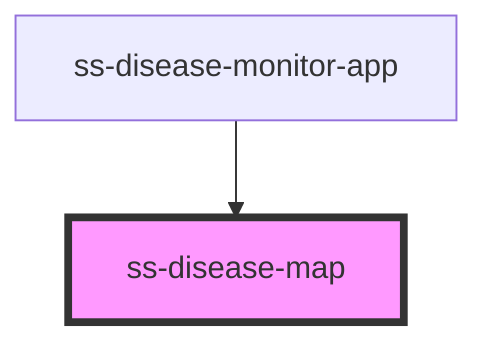

# ss-disease-map

<!-- Auto Generated Below -->

## Properties

| Property       | Attribute       | Description | Type     | Default     |
| -------------- | --------------- | ----------- | -------- | ----------- |
| `apiBase`      | `api-base`      |             | `string` | `undefined` |
| `errorMessage` | `error-message` |             | `string` | `undefined` |
| `imagePath`    | `image-path`    |             | `string` | `""`        |
| `regionId`     | `region-id`     |             | `string` | `undefined` |

## Events

| Event           | Description | Type                  |
| --------------- | ----------- | --------------------- |
| `entry-clicked` |             | `CustomEvent<string>` |
| `map-clicked`   |             | `CustomEvent<string>` |

## Dependencies

### Used by

 - [ss-disease-monitor-app](../ss-disease-monitor-app)

### Graph

----------------------------------------------

*Built with [StencilJS](https://stenciljs.com/)*
