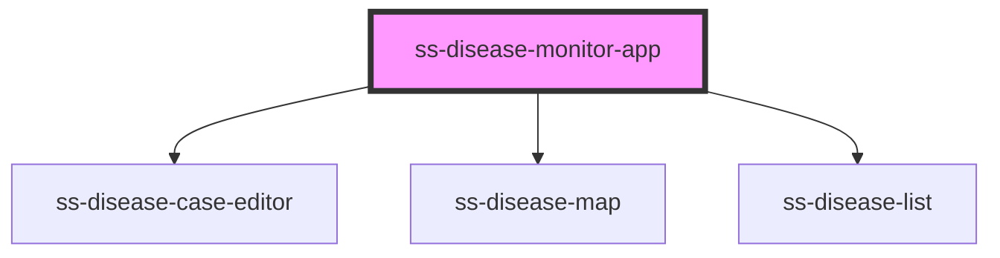

# ss-disease-monitor-app

<!-- Auto Generated Below -->

## Properties

| Property   | Attribute   | Description | Type     | Default |
| ---------- | ----------- | ----------- | -------- | ------- |
| `basePath` | `base-path` |             | `string` | `""`    |

## Dependencies

### Depends on

- [ss-disease-case-editor](../ss-disease-case-editor)
- [ss-disease-map](../ss-disease-map)
- [ss-disease-list](../ss-disease-list)

### Graph

----------------------------------------------

*Built with [StencilJS](https://stenciljs.com/)*
